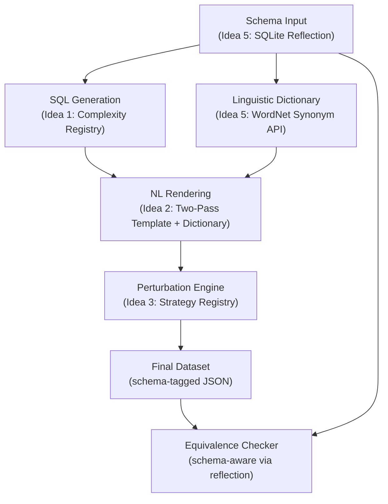

# Schema Generalization Proposals (Revised v2)

## Design Constraints

1. **No LLM** in the generation pipeline (SQL → NL → perturbations). Fully deterministic, in-house.
2. **AST-based** approach must be preserved and extended.
3. **Formal grammar+AST** parser should be explored as a novel research contribution.
4. **Two-pass rendering** (abstract template → linguistic injection) is the preferred direction.
5. **Extensible complexity types.** Easy to add new SQL complexity types (e.g., window functions, CTEs) with their rendering logic and perturbation rules.
6. **Pluggable perturbation strategies.** Add/remove perturbation types and their associated test checks without touching the core engine.
7. **Clean dataset handoff.** The generation pipeline produces a final dataset consumed by a general-purpose equivalence checker that accepts any database.

## Current Extensibility Bottlenecks

Before proposing solutions, here are the specific pain points that block generalization today:

| Bottleneck                            | Files Affected            | Issue                                                                                                                                                                          |
| ------------------------------------- | ------------------------- | ------------------------------------------------------------------------------------------------------------------------------------------------------------------------------ |
| Hardcoded schema                      | `schema.py`               | `SCHEMA`, `FOREIGN_KEYS` dicts are social-media-specific                                                                                                                       |
| Hardcoded synonyms                    | `nl_renderer.py` L100–113 | `schema_synonyms` dict maps only social media table/column names                                                                                                               |
| Monolithic complexity dispatch        | `generator.py` L299–546   | `generate_query()` is a single 250-line if/elif chain over string names                                                                                                        |
| Monolithic render dispatch            | `nl_renderer.py` L224–308 | `render()` dispatches on `isinstance(ast, ...)` and applies perturbations via scattered `if config.is_active(...)` blocks                                                      |
| Hardcoded complexity list             | `generator.py` L275       | `['simple', 'join', 'advanced', 'union', 'insert', 'update', 'delete']` is a literal list                                                                                      |
| Perturbation enum coupling            | `nl_renderer.py` L14–28   | Adding a perturbation requires editing the `PerturbationType` Enum, adding logic inside `render()`, adding a test file, and updating `03_generate_systematic_perturbations.py` |
| Social-media-specific test assertions | `pipeline_tests/`         | Test scripts reference `users`, `posts`, `likes` tables directly                                                                                                               |

---

## Idea 1: Registry-Based Complexity Type Plugins

### Core Concept

Replace the monolithic `generate_query()` if/elif chain and the monolithic `render()` isinstance chain with a **Complexity Type Registry** — a dictionary that maps complexity names to handler objects.

Each complexity type becomes a self-contained plugin class implementing a standard interface:

```python
class ComplexityHandler(ABC):
    """Base class for all SQL complexity type handlers."""

    @abstractmethod
    def generate(self, schema_config, rng) -> exp.Expression:
        """Generate a random SQL AST of this complexity type."""

    @abstractmethod
    def render(self, ast, template_engine, dictionary) -> str:
        """Render this complexity type's AST to an NL template string."""

    @abstractmethod
    def is_applicable(self, ast) -> bool:
        """Check if a given AST matches this complexity type."""
```

The generator and renderer each maintain a registry:

```python
COMPLEXITY_REGISTRY = {
    "simple": SimpleHandler(),
    "join": JoinHandler(),
    "advanced": AdvancedHandler(),
    "union": UnionHandler(),
    "insert": InsertHandler(),
    "update": UpdateHandler(),
    "delete": DeleteHandler(),
}
```

**To add a new complexity type** (e.g., window functions), a developer:

1. Creates `src/complexity/window.py` implementing `ComplexityHandler`
2. Registers it: `COMPLEXITY_REGISTRY["window"] = WindowHandler()`
3. Done. No changes to `generator.py`, `nl_renderer.py`, or the perturbation scripts.

### Evaluation

| Criterion                  | Score | Rationale                                                                                                                                                        |
| -------------------------- | ----- | ---------------------------------------------------------------------------------------------------------------------------------------------------------------- |
| **Novelty**                | 6/10  | Registry/plugin patterns are well-known, but applying them to isolate SQL complexity types as self-contained generation+rendering units is a clean contribution. |
| **Ease of Integration**    | 9/10  | Each existing `generate_*` and `render_*` method already corresponds to one complexity type. Refactoring them into handler classes is mechanical extraction.     |
| **Ease of Implementation** | 8/10  | Straightforward OOP refactoring. The hardest part is ensuring the AdvancedHandler properly encapsulates its 4 subtypes.                                          |
| **Streamlining Impact**    | 9/10  | Eliminates the two largest monolithic functions in the codebase. Makes the complexity list data-driven instead of hardcoded.                                     |

---

## Idea 2: Two-Pass Rendering with a Schema-Derived Linguistic Dictionary

### Core Concept

Split `nl_renderer.py` into two cleanly separated phases:

- **Pass 1 — Abstract Semantic Template (AST → IR):** The renderer walks the SQL AST via the Complexity Handler's `render()` method and produces a domain-agnostic intermediate representation using placeholder tokens:

  ```
  Retrieve [COL:username], [COL:email] from [TABLE:users]
  where [COL:signup_date] [OP:gt] [VAL:datetime('now','-30 days')]
  ```

  This pass encodes **only** structural SQL semantics into ordered English template fragments. It contains zero domain vocabulary.

- **Pass 2 — Linguistic Injection (IR → NL):** A lightweight `DictionaryResolver` substitutes all placeholder tokens against a **Linguistic Dictionary** built per-schema.

### Linguistic Dictionary Construction (No LLM)

The dictionary is constructed automatically using:

1. **WordNet / NLTK synsets** — For each table and column name, programmatically retrieve semantically related English words (e.g., `patients` → `"individuals"`, `"clients"`, `"cases"`).
2. **Snake/camelCase decomposition** — `appointment_date` → `"appointment date"`, `"scheduled date"`.
3. **Universal banks** — Operators (`gt` → `"greater than"`, `"exceeds"`), aggregations (`COUNT` → `"total number of"`), and structural connectors (`"joined with"`, `"combined with"`) are domain-agnostic and shared across all schemas.

### Perturbation Integration

Perturbations operate at **different layers** of this architecture:

- **Template-level perturbations** (e.g., `OMIT_OBVIOUS_CLAUSES`, `MIXED_SQL_NL`) modify the IR before dictionary resolution.
- **Dictionary-level perturbations** (e.g., `TABLE_COLUMN_SYNONYMS`, `SYNONYM_SUBSTITUTION`) swap dictionary entries during resolution.
- **Post-processing perturbations** (e.g., `TYPOS`, `VERBOSITY`, `URGENCY`) transform the final NL string after resolution.

This layered model makes perturbation applicability analysis trivial — template-level perturbations are always structural, dictionary-level are always vocabulary-based, and post-processing perturbations are always string-level.

### Evaluation

| Criterion                  | Score | Rationale                                                                                                                                                                                        |
| -------------------------- | ----- | ------------------------------------------------------------------------------------------------------------------------------------------------------------------------------------------------ |
| **Novelty**                | 7/10  | The layered perturbation model (template vs. dictionary vs. post-processing) applied to SQL→NL is a distinctive design.                                                                          |
| **Ease of Integration**    | 8/10  | The `_render_column`, `_render_table` methods already produce English — they just need to emit placeholders instead of final words. The synonym banks in `__init__` move to the dictionary file. |
| **Ease of Implementation** | 8/10  | Pass 1 simplifies the current code. Pass 2 is string substitution. Dictionary builder is a standalone script using NLTK.                                                                         |
| **Streamlining Impact**    | 10/10 | Adding a new schema becomes: (1) provide DDL, (2) auto-generate dictionary, (3) run pipeline. The renderer itself never needs schema-specific changes.                                           |

---

## Idea 3: Modular Perturbation Strategy Framework

### Core Concept

Replace the `PerturbationType` Enum + scattered `if config.is_active(...)` blocks with a **Perturbation Strategy Registry** where each perturbation is a self-contained, pluggable module.

```python
class PerturbationStrategy(ABC):
    """Base class for all perturbation strategies."""

    name: str               # e.g. "typos"
    layer: str              # "template" | "dictionary" | "post_processing"
    description: str

    @abstractmethod
    def is_applicable(self, ast, nl_template: str) -> bool:
        """Can this perturbation be applied to this query?"""

    @abstractmethod
    def apply(self, nl_text: str, rng: random.Random, context: dict) -> str:
        """Apply the perturbation and return the modified text."""

    @abstractmethod
    def get_test_checks(self) -> list[callable]:
        """Return the validation checks for this perturbation."""
```

Each strategy lives in its own file under `src/perturbations/`:

```
src/perturbations/
├── __init__.py          # Auto-discovers and registers all strategies
├── typos.py             # TyposPerturbation(PerturbationStrategy)
├── verbosity.py         # VerbosityPerturbation(PerturbationStrategy)
├── synonym_sub.py       # SynonymSubPerturbation(PerturbationStrategy)
├── urgency.py           # UrgencyPerturbation(PerturbationStrategy)
└── ...
```

The perturbation script (`03_generate_systematic_perturbations.py`) becomes a generic loop:

```python
for strategy in PerturbationRegistry.all():
    if strategy.is_applicable(ast, baseline_nl):
        perturbed = strategy.apply(baseline_nl, rng, context)
```

**To add a new perturbation:** Create a single file in `src/perturbations/` implementing `PerturbationStrategy`. The file self-registers — no Enum edits, no renderer changes, no test runner changes.

**To remove a perturbation:** Delete the file. Done.

### Test Co-Location

Each strategy's `get_test_checks()` method returns its own validation assertions. The `run_all_perturbation_tests.py` runner auto-discovers strategies and runs their checks — no need for 13 separate test files.

### Evaluation

| Criterion                  | Score | Rationale                                                                                                                                                                |
| -------------------------- | ----- | ------------------------------------------------------------------------------------------------------------------------------------------------------------------------ |
| **Novelty**                | 7/10  | Strategy pattern is classic, but co-locating generation logic, applicability rules, AND test assertions in a single file per perturbation is a clean and unusual design. |
| **Ease of Integration**    | 8/10  | Each existing perturbation's code is already identifiable (a block in `render()` + a test file). Extracting them into strategy classes is surgical.                      |
| **Ease of Implementation** | 7/10  | The main complexity is designing the `context` dict that strategies receive (it needs schema info, AST info, dictionary, etc.).                                          |
| **Streamlining Impact**    | 10/10 | Eliminates the most frequent source of multi-file edits. Adding/removing a perturbation becomes a single-file operation.                                                 |

---

## Idea 4: Attribute Grammar Transduction with Perturbation Operators

### Core Concept

Formalize the rendering engine as a rigorous **Attribute Grammar (AG)** (Knuth, 1968). Every SQL AST node is annotated with two classes of attributes:

- **Synthesized attributes (↑):** Flow upward. A `Column` node synthesizes `{nl_fragment: "[COL:username]", type: "varchar"}`.
- **Inherited attributes (↓):** Flow downward. A `Select` node passes `{query_intent: "retrieval", table_context: "users"}` to its `Where` children.

Each SQL grammar production rule has an associated **semantic action** computing the NL fragment:

```
Production: Select → Columns From Where OrderBy Limit
Semantic Action:
    Select.nl ← Columns.nl + " from " + From.nl + Where.nl + OrderBy.nl + Limit.nl
```

### Perturbations as Formal Operators

Each perturbation becomes a **transformation operator** on the AG's semantic actions. This gives perturbations mathematical rigor:

| Perturbation   | Formal Operator                                                | Operates On                        |
| -------------- | -------------------------------------------------------------- | ---------------------------------- |
| `TYPOS`        | `σ_typo(node.nl, seed)` → char-swap on synthesized NL fragment | Any synthesized `.nl` attribute    |
| `SYNONYM_SUB`  | `σ_syn(node.nl, bank)` → dictionary swap                       | Verb/action synthesized attributes |
| `OMIT_CLAUSES` | `δ_omit(production)` → suppress clause in production           | Specific production rules          |
| `VERBOSITY`    | `ι_verbose(root.nl, fillers)` → inject at root level           | Root node synthesized attribute    |

### Why This is Research-Novel

Most existing attribute grammar literature addresses NL→SQL (parsing natural language into SQL). The **reverse direction** — SQL→NL with formally defined perturbation operators — is a significant gap. The key contributions would be:

1. **Formal AG specification** for SQL→NL that is provably complete for a defined SQL grammar subset.
2. **Perturbation operator algebra** — formal reasoning about which perturbations compose, which are mutually exclusive, and which preserve semantic equivalence class.
3. **Schema-parametric semantic actions** — the AG is inherently generalizable because semantic actions reference the linguistic dictionary, not hardcoded domain terms.

### Extensibility for New Complexity Types

Adding a new complexity type (e.g., window functions) means defining new production rules and their semantic actions. The AG framework naturally separates structure (productions) from vocabulary (dictionary) from perturbation (operators), so each can be extended independently.

### Evaluation

| Criterion                  | Score | Rationale                                                                                                                                                                                               |
| -------------------------- | ----- | ------------------------------------------------------------------------------------------------------------------------------------------------------------------------------------------------------- |
| **Novelty**                | 10/10 | SQL→NL attribute grammars with perturbation operators is a genuine research contribution with no existing precedent.                                                                                    |
| **Ease of Integration**    | 5/10  | Requires restructuring the renderer from procedural walking into declarative AG evaluation. Existing `render_*` methods serve as blueprints for semantic actions.                                       |
| **Ease of Implementation** | 5/10  | Building the AG evaluator engine is moderate effort. The production rules are a direct translation of existing logic, but the formal framework requires careful design.                                 |
| **Streamlining Impact**    | 9/10  | Structure, vocabulary, and perturbation are three orthogonal axes. Each is independently extensible. New complexity types, new schemas, and new perturbations can be added without cross-contamination. |

---

## Idea 5: Schema Bootstrap via SQLite Reflection + Programmatic Synonym API

### Core Concept

Eliminate manual schema definition for both the SQL-facing and NL-facing halves of the pipeline:

**SQL side — SQLite Reflection:**

```python
cursor.execute("SELECT name FROM sqlite_master WHERE type='table'")
cursor.execute(f"PRAGMA table_info({table})")    # columns + types
cursor.execute(f"PRAGMA foreign_key_list({table})")  # FK relationships
```

This auto-populates the schema config that feeds the generator, the renderer, and the equivalence checker. No `schema.py` needed.

**NL side — Programmatic Synonym API (No LLM):**

1. **Name Tokenizer:** `appointment_date` → `["appointment", "date"]`
2. **WordNet Expansion:** For each token, retrieve top-3 synsets → `["booking", "visit", "session"]`
3. **Compound Assembly:** `["booking date", "visit date", "scheduled date"]`
4. **Semantic Category:** Use WordNet hypernym chains to determine articles/pronouns (e.g., `patients` is a "person" → `"their"`, `"they"`)

**Equivalence Checker Integration:**

The same reflected schema automatically provides the seed database structure for the equivalence checker. The `DMLEquivalenceChecker` and `DQLEquivalenceChecker` receive the reflected schema at initialization — no hardcoded table awareness needed.

### Clean Dataset Handoff

The generation pipeline outputs a standardized dataset JSON:

```json
{
  "schema_source": "healthcare.sqlite",
  "dialect": "sqlite",
  "records": [
    {
      "id": 1,
      "complexity": "join",
      "sql": "SELECT ...",
      "nl_prompt": "Retrieve ...",
      "perturbations": { ... }
    }
  ]
}
```

The equivalence checker consumes this schema-tagged dataset and auto-configures its test database generation. No manual wiring.

### Evaluation

| Criterion                  | Score | Rationale                                                                                                                                          |
| -------------------------- | ----- | -------------------------------------------------------------------------------------------------------------------------------------------------- |
| **Novelty**                | 7/10  | Reflection is standard; coupling it with WordNet-based synonym construction and end-to-end schema-tagged dataset handoff is a clean system design. |
| **Ease of Integration**    | 9/10  | Replaces `schema.py` wholesale. The synonym API replaces `schema_synonyms` in `nl_renderer.__init__`. Both are drop-in.                            |
| **Ease of Implementation** | 8/10  | SQLite PRAGMA is trivial. NLTK/WordNet is well-documented. The dataset schema tag is a simple JSON field addition.                                 |
| **Streamlining Impact**    | 9/10  | True zero-config onboarding: drop a `.sqlite` file, run the pipeline. The equivalence checker self-configures from the same reflected schema.      |

---

## Comparative Summary

| Idea                                   | Novelty | Integration | Implementation | Streamlining | **Total** |
| -------------------------------------- | ------- | ----------- | -------------- | ------------ | --------- |
| **1. Complexity Type Registry**        | 6       | 9           | 8              | 9            | **32**    |
| **2. Two-Pass Rendering + Dictionary** | 7       | 8           | 8              | 10           | **33**    |
| **3. Modular Perturbation Framework**  | 7       | 8           | 7              | 10           | **32**    |
| **4. Attribute Grammar Transduction**  | 10      | 5           | 5              | 9            | **29**    |
| **5. SQLite Reflection + Synonym API** | 7       | 9           | 8              | 9            | **33**    |

---

## Recommended Architecture: Layered Combination

These ideas are designed to **compose** into a cohesive architecture. The recommended combination is:



### Layer 1 — Schema Input (Idea 5)

SQLite reflection bootstraps the schema config. WordNet builds the linguistic dictionary. Zero manual configuration.

### Layer 2 — SQL Generation (Idea 1)

Complexity handlers registered in a data-driven registry. Adding window functions = adding one file.

### Layer 3 — NL Rendering (Idea 2)

Two-pass rendering: abstract template → dictionary injection. Schema-agnostic by construction.

### Layer 4 — Perturbation (Idea 3)

Strategy modules in `src/perturbations/`. Each is self-contained with generation logic, applicability rules, and test checks. Adding a perturbation = adding one file. Removing = deleting one file.

### Layer 5 — Dataset & Evaluation (Idea 5)

Schema-tagged dataset JSON flows into the equivalence checker, which auto-configures from the same reflected schema.

### Research Layer (Idea 4)

The Attribute Grammar formalization can be developed in parallel as the theoretical foundation for the two-pass rendering engine. If pursued, it would replace Idea 2's ad-hoc template engine with a formally specified AG evaluator, making the system publishable.

### Impact Summary

| Requirement                 | Addressed By |
| --------------------------- | ------------ |
| Schema generalization       | Ideas 2 + 5  |
| Extensible complexity types | Idea 1       |
| Pluggable perturbations     | Idea 3       |
| Clean dataset handoff       | Idea 5       |
| Research contribution       | Idea 4       |
