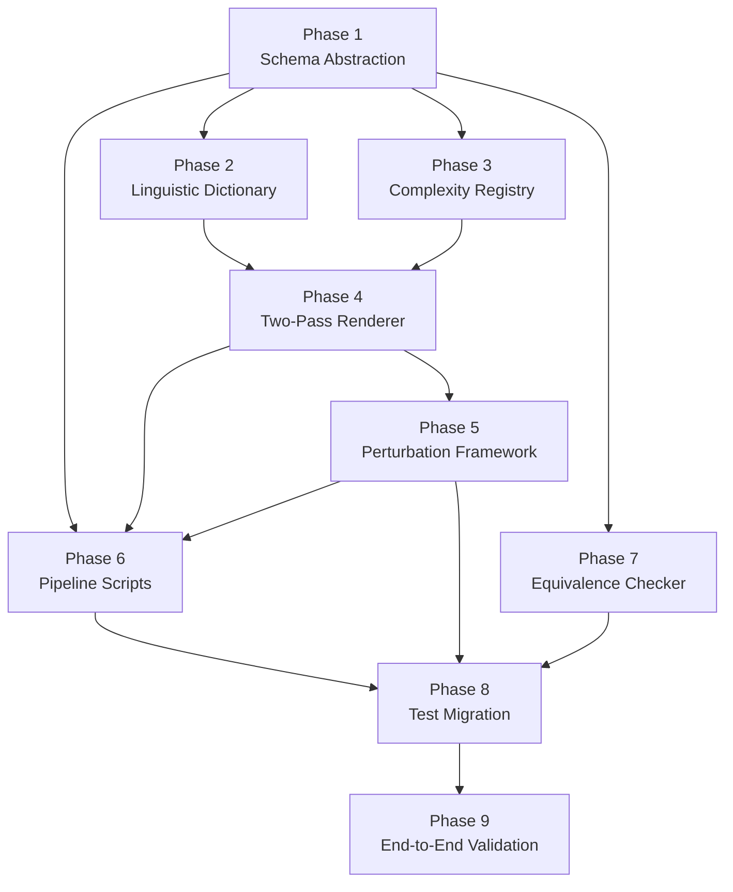

# Implementation Action Plan: Schema-Agnostic Pipeline Overhaul

> **Reference:** [SCHEMA_GENERALIZATION_PROPOSALS.md](file:///Users/obby/Documents/experiment/random/sql-nl/SCHEMA_GENERALIZATION_PROPOSALS.md)
> **Date:** 2026-02-25
> **Goal:** Transform the current social-media-hardcoded SQL→NL→Perturbation→Evaluation pipeline into a schema-agnostic, extensible framework.

---

## Table of Contents

1. [Phase 1: Schema Abstraction Layer](#phase-1-schema-abstraction-layer)
2. [Phase 2: Linguistic Dictionary Builder](#phase-2-linguistic-dictionary-builder)
3. [Phase 3: Complexity Type Registry](#phase-3-complexity-type-registry)
4. [Phase 4: Two-Pass NL Renderer](#phase-4-two-pass-nl-renderer)
5. [Phase 5: Modular Perturbation Framework](#phase-5-modular-perturbation-framework)
6. [Phase 6: Pipeline Script Refactoring](#phase-6-pipeline-script-refactoring)
7. [Phase 7: Equivalence Checker Generalization](#phase-7-equivalence-checker-generalization)
8. [Phase 8: Test Suite Migration](#phase-8-test-suite-migration)
9. [Phase 9: End-to-End Validation](#phase-9-end-to-end-validation)

---

## Phase 1: Schema Abstraction Layer

**Goal:** Replace `src/core/schema.py` (hardcoded social media dicts) with a general-purpose `SchemaConfig` object that can be hydrated from **any** source: a YAML file, a `.sqlite` file via reflection, or programmatic construction.

### Step 1.1: Create the `SchemaConfig` dataclass

- [ ] **File:** `src/core/schema_config.py` [NEW]
- [ ] Define a `SchemaConfig` dataclass that holds all schema information in a domain-agnostic format.

```python
# src/core/schema_config.py
from dataclasses import dataclass, field
from typing import Dict, List, Set, Tuple, Optional

@dataclass
class ColumnDef:
    """Definition of a single database column."""
    name: str
    col_type: str  # "int", "varchar", "text", "datetime", "boolean"
    is_pk: bool = False
    is_fk: bool = False
    fk_references: Optional[Tuple[str, str]] = None  # (target_table, target_column)

@dataclass
class TableDef:
    """Definition of a single database table."""
    name: str
    columns: Dict[str, ColumnDef] = field(default_factory=dict)
    primary_keys: List[str] = field(default_factory=list)

    @property
    def column_names(self) -> Set[str]:
        return set(self.columns.keys())

    def columns_of_type(self, *types: str) -> List[str]:
        return [c.name for c in self.columns.values() if c.col_type in types]

@dataclass
class ForeignKeyDef:
    """Definition of a foreign key relationship."""
    source_table: str
    source_column: str
    target_table: str
    target_column: str

@dataclass
class SchemaConfig:
    """Complete, domain-agnostic schema configuration."""
    tables: Dict[str, TableDef] = field(default_factory=dict)
    foreign_keys: List[ForeignKeyDef] = field(default_factory=list)
    dialect: str = "sqlite"
    schema_name: str = "unnamed"

    # Column type categories (universal defaults)
    numeric_types: Set[str] = field(default_factory=lambda: {"int", "integer", "real", "float"})
    text_types: Set[str] = field(default_factory=lambda: {"varchar", "text", "char"})
    date_types: Set[str] = field(default_factory=lambda: {"datetime", "date", "timestamp"})
    boolean_types: Set[str] = field(default_factory=lambda: {"boolean", "bool"})

    @property
    def table_names(self) -> Set[str]:
        return set(self.tables.keys())

    def get_fk_pairs(self) -> Dict[Tuple[str,str], Tuple[str,str]]:
        """Return FOREIGN_KEYS in the legacy (table_a, table_b): (col_a, col_b) format
        for backward compatibility during migration."""
        result = {}
        for fk in self.foreign_keys:
            result[(fk.source_table, fk.target_table)] = (fk.source_column, fk.target_column)
        return result

    def get_legacy_schema(self) -> Dict[str, Dict[str, str]]:
        """Return SCHEMA in the legacy {table: {col: type}} format
        for backward compatibility during migration."""
        result = {}
        for tname, tdef in self.tables.items():
            result[tname] = {c.name: c.col_type for c in tdef.columns.values()}
        return result
```

> **Why the legacy-format methods?** They allow us to migrate incrementally — existing code can call `config.get_legacy_schema()` and `config.get_fk_pairs()` and work unchanged until each consumer is individually updated to use the new dataclass API.

### Step 1.2: Create schema loaders

- [ ] **File:** `src/core/schema_loader.py` [NEW]
- [ ] Implement three loader functions:

```python
# src/core/schema_loader.py
import yaml
import sqlite3
from .schema_config import SchemaConfig, TableDef, ColumnDef, ForeignKeyDef

def load_from_yaml(yaml_path: str) -> SchemaConfig:
    """Load schema from a YAML definition file."""
    with open(yaml_path) as f:
        data = yaml.safe_load(f)

    config = SchemaConfig(dialect=data.get("dialect", "sqlite"),
                          schema_name=data.get("name", "unnamed"))
    for tname, tdata in data.get("tables", {}).items():
        cols = {}
        pks = []
        for cname, cinfo in tdata.get("columns", {}).items():
            ctype = cinfo if isinstance(cinfo, str) else cinfo.get("type", "varchar")
            is_pk = isinstance(cinfo, dict) and cinfo.get("is_pk", False)
            cols[cname] = ColumnDef(name=cname, col_type=ctype, is_pk=is_pk)
            if is_pk:
                pks.append(cname)
        config.tables[tname] = TableDef(name=tname, columns=cols, primary_keys=pks)
    for fk in data.get("foreign_keys", []):
        config.foreign_keys.append(ForeignKeyDef(
            source_table=fk[0], source_column=fk[2],
            target_table=fk[1], target_column=fk[3]
        ))
    return config


def load_from_sqlite(db_path: str) -> SchemaConfig:
    """Reflect schema from an existing SQLite database file."""
    conn = sqlite3.connect(db_path)
    cursor = conn.cursor()
    config = SchemaConfig(dialect="sqlite", schema_name=db_path)

    # Discover tables
    cursor.execute("SELECT name FROM sqlite_master WHERE type='table' AND name NOT LIKE 'sqlite_%'")
    table_names = [row[0] for row in cursor.fetchall()]

    for tname in table_names:
        cursor.execute(f"PRAGMA table_info('{tname}')")
        cols = {}
        pks = []
        for row in cursor.fetchall():
            # row: (cid, name, type, notnull, dflt_value, pk)
            cname = row[1]
            ctype = row[2].lower() if row[2] else "text"
            is_pk = bool(row[5])
            cols[cname] = ColumnDef(name=cname, col_type=_normalize_type(ctype), is_pk=is_pk)
            if is_pk:
                pks.append(cname)
        config.tables[tname] = TableDef(name=tname, columns=cols, primary_keys=pks)

        # Discover foreign keys
        cursor.execute(f"PRAGMA foreign_key_list('{tname}')")
        for fk_row in cursor.fetchall():
            # fk_row: (id, seq, table, from, to, on_update, on_delete, match)
            config.foreign_keys.append(ForeignKeyDef(
                source_table=tname, source_column=fk_row[3],
                target_table=fk_row[2], target_column=fk_row[4]
            ))

    conn.close()
    return config


def load_from_legacy() -> SchemaConfig:
    """Load from the existing hardcoded src/core/schema.py for backward compat."""
    from src.core.schema import SCHEMA, FOREIGN_KEYS
    config = SchemaConfig(dialect="sqlite", schema_name="social_media")
    for tname, tcols in SCHEMA.items():
        cols = {cname: ColumnDef(name=cname, col_type=ctype) for cname, ctype in tcols.items()}
        config.tables[tname] = TableDef(name=tname, columns=cols)
    for (t1, t2), (c1, c2) in FOREIGN_KEYS.items():
        config.foreign_keys.append(ForeignKeyDef(
            source_table=t1, source_column=c1, target_table=t2, target_column=c2
        ))
    return config


def _normalize_type(raw_type: str) -> str:
    """Normalize SQLite type affinity names to our canonical types."""
    raw = raw_type.lower().strip()
    if "int" in raw: return "int"
    if "char" in raw or "text" in raw or "clob" in raw: return "varchar"
    if "real" in raw or "floa" in raw or "doub" in raw: return "real"
    if "bool" in raw: return "boolean"
    if "date" in raw or "time" in raw: return "datetime"
    return "varchar"  # SQLite default affinity
```

### Step 1.3: Create a sample YAML schema for the social media domain

- [ ] **File:** `schemas/social_media.yaml` [NEW]

```yaml
name: social_media
dialect: sqlite
tables:
  users:
    columns:
      id: { type: int, is_pk: true }
      username: varchar
      email: varchar
      signup_date: datetime
      is_verified: boolean
      country_code: varchar
  posts:
    columns:
      id: { type: int, is_pk: true }
      user_id: int
      content: text
      posted_at: datetime
      view_count: int
  comments:
    columns:
      id: { type: int, is_pk: true }
      user_id: int
      post_id: int
      comment_text: text
      created_at: datetime
  likes:
    columns:
      user_id: int
      post_id: int
      liked_at: datetime
  follows:
    columns:
      follower_id: int
      followee_id: int
      followed_at: datetime
foreign_keys:
  - [users, posts, id, user_id]
  - [users, comments, id, user_id]
  - [posts, comments, id, post_id]
  - [users, likes, id, user_id]
  - [posts, likes, id, post_id]
  - [users, follows, id, follower_id]
```

### Step 1.4: Verify parity with existing schema

- [ ] Write a quick validation script or test that loads `schemas/social_media.yaml` via `load_from_yaml()` and asserts that `config.get_legacy_schema()` exactly matches the dict in `src/core/schema.py`, and `config.get_fk_pairs()` matches `FOREIGN_KEYS`.
- [ ] Also test `load_from_sqlite()` against a test `.sqlite` file to confirm reflection produces the same structure.

**Verification command:**

```bash
python -c "
from src.core.schema_loader import load_from_yaml, load_from_legacy
yaml_cfg = load_from_yaml('schemas/social_media.yaml')
legacy_cfg = load_from_legacy()
assert yaml_cfg.get_legacy_schema() == legacy_cfg.get_legacy_schema(), 'Schema mismatch!'
print('✓ Schema parity confirmed')
"
```

---

## Phase 2: Linguistic Dictionary Builder

**Goal:** Build a system that automatically generates synonym banks and NL vocabulary for any schema, using WordNet/NLTK — no LLM involved.

### Step 2.1: Create the `LinguisticDictionary` dataclass

- [ ] **File:** `src/core/linguistic_dictionary.py` [NEW]

```python
from dataclasses import dataclass, field
from typing import Dict, List, Set

@dataclass
class LinguisticDictionary:
    """Domain-specific vocabulary for NL rendering."""

    # Table synonyms: table_name -> list of English synonyms
    # e.g. {"users": ["accounts", "members", "profiles"]}
    table_synonyms: Dict[str, List[str]] = field(default_factory=dict)

    # Column synonyms: "table.column" -> list of English synonyms
    # e.g. {"users.signup_date": ["registration date", "join date"]}
    column_synonyms: Dict[str, List[str]] = field(default_factory=dict)

    # Semantic categories for tables (for pronoun/article selection)
    # e.g. {"users": "person", "posts": "object"}
    table_categories: Dict[str, str] = field(default_factory=dict)

    # --- Universal banks (same for all schemas) ---
    action_verbs: Dict[str, List[str]] = field(default_factory=lambda: {
        "get": ["Get", "Retrieve", "Find", "Pull up", "Dig out", "Fetch me"],
        "select": ["Select", "Pick out", "Spot", "Single out", "Choose"],
        "show": ["Show", "Display", "Bring up", "Give me a look at", "Produce a listing of"],
        "insert": ["Add", "Insert", "Put", "Include", "Create"],
        "update": ["Update", "Change", "Modify", "Adjust", "Edit"],
        "delete": ["Remove", "Delete", "Drop", "Strip out", "Wipe out"],
    })

    operator_synonyms: Dict[str, List[str]] = field(default_factory=lambda: {
        "eq": ["equals", "is", "matches", "is equal to"],
        "neq": ["is not equal to", "differs from", "is not"],
        "gt": ["greater than", "exceeds", "more than", "above"],
        "lt": ["less than", "below", "under", "fewer than"],
        "gte": ["at least", "greater than or equal to", "minimum of"],
        "lte": ["at most", "less than or equal to", "no more than"],
    })

    aggregate_synonyms: Dict[str, List[str]] = field(default_factory=lambda: {
        "COUNT": ["total number of", "how many", "count of", "number of"],
        "SUM": ["total", "sum of", "add up"],
        "AVG": ["average", "mean", "typical"],
        "MAX": ["maximum", "highest", "largest"],
        "MIN": ["minimum", "lowest", "smallest"],
    })

    structural_connectors: Dict[str, List[str]] = field(default_factory=lambda: {
        "where": ["where", "filtered for", "looking only at", "for which", "that have"],
        "from": ["from", "in", "within", "out of"],
        "and": ["and", "where also", "as well as", "along with"],
        "joined with": ["joined with", "linked to", "connected to", "join"],
    })

    def lookup_table(self, table_name: str) -> List[str]:
        """Return synonyms for a table name, defaulting to the name itself."""
        return self.table_synonyms.get(table_name, [table_name])

    def lookup_column(self, table_name: str, column_name: str) -> List[str]:
        """Return synonyms for a column, defaulting to the name itself."""
        key = f"{table_name}.{column_name}"
        return self.column_synonyms.get(key, [column_name.replace("_", " ")])
```

### Step 2.2: Create the automated dictionary builder

- [ ] **File:** `src/core/dictionary_builder.py` [NEW]
- [ ] Uses NLTK WordNet to build domain-specific synonyms from schema identifiers.

```python
# src/core/dictionary_builder.py
import re
from typing import List
from .schema_config import SchemaConfig
from .linguistic_dictionary import LinguisticDictionary

def build_dictionary(schema: SchemaConfig, use_wordnet: bool = True) -> LinguisticDictionary:
    """
    Build a LinguisticDictionary from a SchemaConfig.

    1. Tokenize table/column names (snake_case splitting).
    2. If use_wordnet=True, expand tokens with WordNet synsets.
    3. Assemble compound synonyms.
    """
    dictionary = LinguisticDictionary()

    for tname, tdef in schema.tables.items():
        tokens = _tokenize_identifier(tname)

        # Table synonyms
        table_syns = _expand_tokens(tokens, use_wordnet)
        dictionary.table_synonyms[tname] = [tname] + table_syns

        # Table semantic category
        dictionary.table_categories[tname] = _infer_category(tokens, use_wordnet)

        # Column synonyms
        for cname in tdef.columns:
            col_tokens = _tokenize_identifier(cname)
            col_syns = _expand_compound(col_tokens, use_wordnet)
            key = f"{tname}.{cname}"
            dictionary.column_synonyms[key] = [cname.replace("_", " ")] + col_syns

    return dictionary


def _tokenize_identifier(name: str) -> List[str]:
    """Split snake_case or camelCase identifier into word tokens.
    'appointment_date' -> ['appointment', 'date']
    'userId' -> ['user', 'id']
    """
    # Handle snake_case
    parts = name.split("_")
    # Handle camelCase within each part
    tokens = []
    for part in parts:
        camel_split = re.sub(r'([a-z])([A-Z])', r'\1_\2', part).split('_')
        tokens.extend([t.lower() for t in camel_split if t])
    return tokens


def _expand_tokens(tokens: List[str], use_wordnet: bool) -> List[str]:
    """Expand individual tokens with WordNet synonyms."""
    if not use_wordnet:
        return []
    try:
        from nltk.corpus import wordnet as wn
        synonyms = set()
        for token in tokens:
            for synset in wn.synsets(token)[:3]:  # Top 3 synsets
                for lemma in synset.lemmas()[:4]:  # Top 4 lemmas per synset
                    syn = lemma.name().replace("_", " ").lower()
                    if syn != token and len(syn) > 2:
                        synonyms.add(syn)
        return list(synonyms)[:6]  # Cap at 6 synonyms
    except ImportError:
        return []


def _expand_compound(tokens: List[str], use_wordnet: bool) -> List[str]:
    """Expand compound identifiers by substituting individual tokens.
    ['appointment', 'date'] -> ['booking date', 'visit date', 'scheduled date']
    """
    if not use_wordnet or len(tokens) < 2:
        return _expand_tokens(tokens, use_wordnet)
    try:
        from nltk.corpus import wordnet as wn
        # Expand the primary semantic token (usually the first, non-'id' token)
        primary = [t for t in tokens if t not in ('id', 'at', 'by')]
        if not primary:
            return []
        target = primary[0]
        alternatives = set()
        for synset in wn.synsets(target)[:3]:
            for lemma in synset.lemmas()[:3]:
                alt = lemma.name().replace("_", " ").lower()
                if alt != target and len(alt) > 2:
                    # Reconstruct compound: replace target with alternative
                    new_tokens = [alt if t == target else t for t in tokens]
                    alternatives.add(" ".join(new_tokens))
        return list(alternatives)[:5]
    except ImportError:
        return []


def _infer_category(tokens: List[str], use_wordnet: bool) -> str:
    """Infer whether a table represents people, objects, events, etc."""
    person_indicators = {"user", "member", "patient", "doctor", "employee",
                         "customer", "client", "person", "student", "teacher"}
    event_indicators = {"event", "appointment", "meeting", "session", "visit"}
    if any(t in person_indicators for t in tokens):
        return "person"
    if any(t in event_indicators for t in tokens):
        return "event"
    return "object"
```

### Step 2.3: Save/load dictionary as YAML

- [ ] Add `save_dictionary(dictionary, path)` and `load_dictionary(path)` functions to `dictionary_builder.py` so the generated dictionary can be reviewed, manually edited, and version-controlled.

### Step 2.4: Verify dictionary quality

- [ ] Run the builder on the social media schema and compare its output synonyms against the hardcoded `schema_synonyms` in `nl_renderer.py` L100–113. Ensure at least 70% overlap (the WordNet synonyms will differ slightly from the hand-picked ones, and that's expected).

**Verification command:**

```bash
python -c "
from src.core.schema_loader import load_from_yaml
from src.core.dictionary_builder import build_dictionary
cfg = load_from_yaml('schemas/social_media.yaml')
d = build_dictionary(cfg,  use_wordnet=True)
for t, syns in d.table_synonyms.items():
    print(f'{t}: {syns}')
for k, syns in list(d.column_synonyms.items())[:10]:
    print(f'{k}: {syns}')
"
```

---

## Phase 3: Complexity Type Registry

**Goal:** Replace the monolithic `generate_query()` if/elif chain and `render()` isinstance chain with a plugin registry.

### Step 3.1: Define the `ComplexityHandler` abstract base class

- [ ] **File:** `src/complexity/__init__.py` [NEW]
- [ ] **File:** `src/complexity/base.py` [NEW]

```python
# src/complexity/base.py
from abc import ABC, abstractmethod
from typing import Tuple
from sqlglot import exp
from src.core.schema_config import SchemaConfig

class ComplexityHandler(ABC):
    """Base class for all SQL complexity type handlers."""

    name: str  # e.g., "simple", "join", "advanced"

    @abstractmethod
    def generate(self, schema: SchemaConfig, rng) -> Tuple[exp.Expression, str]:
        """Generate a random SQL AST of this complexity type.
        Returns (ast, complexity_name).
        """

    @abstractmethod
    def render_to_template(self, ast: exp.Expression, context: dict) -> str:
        """Render this complexity type's AST to an abstract NL template string.
        Template uses placeholders like [TABLE:users], [COL:email], [OP:gt].
        """

    @abstractmethod
    def is_match(self, ast: exp.Expression) -> bool:
        """Check if a given AST matches this complexity type."""
```

### Step 3.2: Extract existing logic into handler classes

Each handler class encapsulates the generation logic from `generator.py` and the rendering logic from `nl_renderer.py` for its complexity type.

- [ ] **File:** `src/complexity/simple.py` [NEW] — Extract from `generate_query()` L321–335 and `render_select()` L312–381
- [ ] **File:** `src/complexity/join.py` [NEW] — Extract from `generate_query()` L337–370 and `_render_join()` L508–563
- [ ] **File:** `src/complexity/advanced.py` [NEW] — Extract from `generate_query()` L380–546 (with 4 subtypes) and `_render_subquery()` L952–980
- [ ] **File:** `src/complexity/union.py` [NEW] — Extract from `generate_union()` L208–247 and `render_union()` L384–412
- [ ] **File:** `src/complexity/insert.py` [NEW] — Extract from `generate_insert()` L114–144 and `render_insert()` L415–451
- [ ] **File:** `src/complexity/update.py` [NEW] — Extract from `generate_update()` L146–196 and `render_update()` L454–484
- [ ] **File:** `src/complexity/delete.py` [NEW] — Extract from `generate_delete()` L198–206 and `render_delete()` L487–506

### Step 3.3: Build the registry

- [ ] **File:** `src/complexity/registry.py` [NEW]

```python
# src/complexity/registry.py
from typing import Dict
from .base import ComplexityHandler
from .simple import SimpleHandler
from .join_handler import JoinHandler
from .advanced import AdvancedHandler
from .union import UnionHandler
from .insert import InsertHandler
from .update import UpdateHandler
from .delete import DeleteHandler

COMPLEXITY_REGISTRY: Dict[str, ComplexityHandler] = {
    "simple": SimpleHandler(),
    "join": JoinHandler(),
    "advanced": AdvancedHandler(),
    "union": UnionHandler(),
    "insert": InsertHandler(),
    "update": UpdateHandler(),
    "delete": DeleteHandler(),
}

def register(name: str, handler: ComplexityHandler):
    """Register a new complexity type handler at runtime."""
    COMPLEXITY_REGISTRY[name] = handler

def get_handler(name: str) -> ComplexityHandler:
    return COMPLEXITY_REGISTRY[name]

def all_handlers() -> Dict[str, ComplexityHandler]:
    return COMPLEXITY_REGISTRY
```

### Step 3.4: Update generator.py to use the registry

- [ ] **File:** `src/core/generator.py` [MODIFY]
- [ ] Replace the `generate_query()` if/elif chain with:

```python
def generate_query(self, complexity=None):
    from src.complexity.registry import get_handler, all_handlers
    if complexity is None:
        complexity = random.choice(list(all_handlers().keys()))
    handler = get_handler(complexity)
    return handler.generate(self.schema_config, self._rng), complexity
```

- [ ] Replace the hardcoded list in `generate_dataset()` with:

```python
def generate_dataset(self, num_per_complexity=300):
    from src.complexity.registry import all_handlers
    complexity_types = list(all_handlers().keys())
    # ... rest of loop unchanged
```

### Step 3.5: Verify generation parity

- [ ] Generate a dataset with the new registry-based generator and compare the output structure (number of records per complexity, valid SQL) against a known-good dataset.

**Verification command:**

```bash
python 01_generate_sql_dataset.py
python pipeline_tests/generation_process/sql/test_sql_generation.py
```

Expected: All 37 checks pass with 0 failures.

---

## Phase 4: Two-Pass NL Renderer

**Goal:** Split NL rendering into Pass 1 (abstract template) and Pass 2 (linguistic injection).

### Step 4.1: Define the Intermediate Representation (IR) token format

- [ ] Establish a simple token convention. Tokens are enclosed in square brackets with a type prefix:

| Token           | Meaning              | Example                |
| --------------- | -------------------- | ---------------------- |
| `[TABLE:users]` | Table reference      | `[TABLE:patients]`     |
| `[COL:email]`   | Column reference     | `[COL:admission_date]` |
| `[OP:gt]`       | Comparison operator  | `[OP:lte]`             |
| `[AGG:COUNT]`   | Aggregate function   | `[AGG:AVG]`            |
| `[VAL:42]`      | Literal value        | `[VAL:'active']`       |
| `[VERB:get]`    | Action verb key      | `[VERB:insert]`        |
| `[CONN:where]`  | Structural connector | `[CONN:joined with]`   |

### Step 4.2: Refactor the renderer to emit IR tokens

- [ ] **File:** `src/core/nl_renderer.py` [MODIFY]
- [ ] Create a new method `render_template(self, ast) -> str` that produces template IR.
- [ ] Modify `_render_table()` (L758–823): instead of returning `"users"` or a synonym, return `[TABLE:users]`.
- [ ] Modify `_render_column()` (L825–936): instead of returning `"the user's email"`, return `[COL:email]`.
- [ ] Modify `_render_expression()` (L565–756): instead of returning `"equals"`, return `[OP:eq]`.
- [ ] Keep the existing `render()` method working unchanged during migration by having it call `render_template()` internally and resolve immediately (backward compat).

**Example transformation for `render_select()`:**

Current output:

```
Get the username, email from users where signup_date greater than 30 days ago
```

New IR (Pass 1) output:

```
[VERB:get] [COL:username], [COL:email] [CONN:from] [TABLE:users] [CONN:where] [COL:signup_date] [OP:gt] [VAL:30 days ago]
```

### Step 4.3: Create the Dictionary Resolver (Pass 2)

- [ ] **File:** `src/core/template_resolver.py` [NEW]

```python
# src/core/template_resolver.py
import re
import random
from .linguistic_dictionary import LinguisticDictionary

class TemplateResolver:
    """Resolves IR template tokens against a LinguisticDictionary."""

    TOKEN_PATTERN = re.compile(r'\[(\w+):([^\]]+)\]')

    def __init__(self, dictionary: LinguisticDictionary, seed: int = 42):
        self.dictionary = dictionary
        self.rng = random.Random(seed)

    def resolve(self, template: str, table_context: str = "") -> str:
        """Replace all [TYPE:value] tokens with natural language."""
        def replacer(match):
            token_type = match.group(1)
            token_value = match.group(2)
            return self._resolve_token(token_type, token_value, table_context)
        return self.TOKEN_PATTERN.sub(replacer, template)

    def _resolve_token(self, token_type: str, value: str, table_ctx: str) -> str:
        d = self.dictionary
        if token_type == "TABLE":
            return self.rng.choice(d.lookup_table(value))
        elif token_type == "COL":
            return self.rng.choice(d.lookup_column(table_ctx, value))
        elif token_type == "OP":
            ops = d.operator_synonyms.get(value, [value])
            return self.rng.choice(ops)
        elif token_type == "AGG":
            aggs = d.aggregate_synonyms.get(value, [value])
            return self.rng.choice(aggs)
        elif token_type == "VERB":
            verbs = d.action_verbs.get(value, [value.capitalize()])
            return self.rng.choice(verbs)
        elif token_type == "CONN":
            conns = d.structural_connectors.get(value, [value])
            return self.rng.choice(conns)
        elif token_type == "VAL":
            return value  # Values pass through unchanged
        else:
            return value
```

### Step 4.4: Wire the two-pass pipeline together

- [ ] The new render flow is:

```python
# In the pipeline script (02_generate_nl_prompts.py):
template = renderer.render_template(ast)       # Pass 1: AST → IR
nl_prompt = resolver.resolve(template)          # Pass 2: IR → NL
```

### Step 4.5: Verify NL quality

- [ ] Run the NL prompt tests on output generated by the new two-pass system.

**Verification command:**

```bash
python 02_generate_nl_prompts.py
python pipeline_tests/generation_process/nl_prompt/test_nl_prompt.py
```

Expected: All 62 checks pass. Failures on synonym-specific checks (e.g., `star_maps_to_all_columns`) may need the test assertions relaxed to accept the new dictionary's synonym choices.

---

## Phase 5: Modular Perturbation Framework

**Goal:** Replace the `PerturbationType` Enum and scattered `if config.is_active(...)` blocks with a self-registering strategy module system.

### Step 5.1: Define the `PerturbationStrategy` ABC

- [ ] **File:** `src/perturbations/__init__.py` [NEW]
- [ ] **File:** `src/perturbations/base.py` [NEW]

```python
# src/perturbations/base.py
from abc import ABC, abstractmethod
from typing import Optional, List, Callable
from sqlglot import exp
import random

class PerturbationStrategy(ABC):
    """Base class for all perturbation strategies."""

    name: str           # Machine name, e.g. "typos"
    display_name: str   # Human name, e.g. "Keyboard Typos"
    description: str    # What this perturbation does.
    layer: str          # "template" | "dictionary" | "post_processing"

    @abstractmethod
    def is_applicable(self, ast: exp.Expression, nl_text: str, context: dict) -> bool:
        """Can this perturbation be meaningfully applied to this query?"""

    @abstractmethod
    def apply(self, nl_text: str, rng: random.Random, context: dict) -> str:
        """Apply the perturbation and return the modified NL text.

        Args:
            nl_text: The baseline NL prompt (or IR template, depending on layer).
            rng: Seeded RNG for determinism.
            context: Dict with keys: 'ast', 'schema', 'dictionary', 'template', etc.
        """

    def get_test_checks(self) -> List[Callable]:
        """Return validation check functions for this perturbation.
        Each callable takes (record, baseline_nl, perturbed_nl, context) -> (pass: bool, detail: str).
        Return an empty list if no automated checks are defined.
        """
        return []
```

### Step 5.2: Extract each perturbation into its own strategy file

Each file is self-contained with the generation logic, applicability rules, and test checks.

- [ ] `src/perturbations/typos.py` — Extract from `render()` L272–293 and `test_typos.py`
- [ ] `src/perturbations/verbosity.py` — Extract from `render()` L258–261 and `test_verbosity_variation.py`
- [ ] `src/perturbations/urgency.py` — Extract from `render()` L302–306 and `test_urgency_qualifiers.py`
- [ ] `src/perturbations/punctuation.py` — Extract from `render()` L264–269 and `test_punctuation_variation.py`
- [ ] `src/perturbations/comment_annotations.py` — Extract from `render()` L296–300 and `test_comment_annotations.py`
- [ ] `src/perturbations/synonym_substitution.py` — Extract from `_choose_word()` and `test_phrasal_and_idiomatic_action_substitution.py`
- [ ] `src/perturbations/mixed_sql_nl.py` — Extract and `test_mixed_sql_nl.py`
- [ ] `src/perturbations/table_column_synonyms.py` — Extract and `test_table_column_synonyms.py`
- [ ] `src/perturbations/operator_aggregate_variation.py` — Extract and `test_operator_aggregate_variation.py`
- [ ] `src/perturbations/temporal_expression.py` — Extract and `test_temporal_expression_variation.py`
- [ ] `src/perturbations/omit_obvious.py` — Extract and `test_omit_obvious_operation_markers.py`
- [ ] `src/perturbations/incomplete_join.py` — Extract and `test_incomplete_join_spec.py`
- [ ] `src/perturbations/ambiguous_pronouns.py` — Extract and `test_anchored_pronoun_references.py`

**Example: `src/perturbations/typos.py`**

```python
# src/perturbations/typos.py
from .base import PerturbationStrategy
from sqlglot import exp
import random

class TyposPerturbation(PerturbationStrategy):
    name = "typos"
    display_name = "Keyboard Typos"
    description = "Introduce 1-2 realistic keyboard typos in the NL prompt."
    layer = "post_processing"

    def is_applicable(self, ast, nl_text, context):
        # Typos are almost always applicable (need >= 2 char words)
        words = nl_text.split()
        return any(len(w) >= 2 for w in words)

    def apply(self, nl_text, rng, context):
        words = nl_text.split()
        candidates = [i for i, w in enumerate(words) if len(w) >= 2]
        if not candidates:
            return nl_text
        num_typos = max(1, int(len(words) * 0.3))
        targets = rng.sample(candidates, min(len(candidates), num_typos))
        for idx in targets:
            word = words[idx]
            char_idx = rng.randint(0, len(word) - 2)
            chars = list(word)
            chars[char_idx], chars[char_idx + 1] = chars[char_idx + 1], chars[char_idx]
            words[idx] = "".join(chars)
        return " ".join(words)

    def get_test_checks(self):
        return [
            self._check_prompt_is_different,
            self._check_edit_distance,
            self._check_not_all_corrupted,
        ]

    def _check_prompt_is_different(self, record, baseline, perturbed, ctx):
        return perturbed.strip() != baseline.strip(), "Perturbed == original"

    def _check_edit_distance(self, record, baseline, perturbed, ctx):
        from collections import Counter
        c1, c2 = Counter(baseline.lower()), Counter(perturbed.lower())
        dist = sum((c1 - c2).values()) + sum((c2 - c1).values())
        return dist <= 20, f"Edit distance {dist} > 20"

    def _check_not_all_corrupted(self, record, baseline, perturbed, ctx):
        orig_tokens = baseline.lower().split()
        pert_set = set(perturbed.lower().split())
        ratio = sum(1 for t in orig_tokens if t in pert_set) / max(len(orig_tokens), 1)
        return ratio >= 0.50, f"Only {ratio:.0%} tokens unchanged"
```

### Step 5.3: Build the perturbation registry with auto-discovery

- [ ] **File:** `src/perturbations/registry.py` [NEW]

```python
# src/perturbations/registry.py
import importlib
import pkgutil
from typing import Dict, List
from .base import PerturbationStrategy

_REGISTRY: Dict[str, PerturbationStrategy] = {}

def _discover():
    """Auto-discover all PerturbationStrategy subclasses in this package."""
    import src.perturbations as pkg
    for importer, modname, ispkg in pkgutil.iter_modules(pkg.__path__):
        if modname in ("base", "registry", "__init__"):
            continue
        module = importlib.import_module(f"src.perturbations.{modname}")
        for attr_name in dir(module):
            attr = getattr(module, attr_name)
            if (isinstance(attr, type) and issubclass(attr, PerturbationStrategy)
                    and attr is not PerturbationStrategy):
                instance = attr()
                _REGISTRY[instance.name] = instance

def all_strategies() -> Dict[str, PerturbationStrategy]:
    if not _REGISTRY:
        _discover()
    return _REGISTRY

def get_strategy(name: str) -> PerturbationStrategy:
    return all_strategies()[name]
```

### Step 5.4: Update the perturbation generation script

- [ ] **File:** `03_generate_systematic_perturbations.py` [MODIFY]
- [ ] Replace the `PerturbationType` enum iteration with:

```python
from src.perturbations.registry import all_strategies

for name, strategy in all_strategies().items():
    is_app = strategy.is_applicable(ast, baseline_nl, context)
    entry = {"perturbation_name": name, "applicable": is_app, "perturbed_nl_prompt": None}
    if is_app:
        perturbed = strategy.apply(baseline_nl, rng, context)
        if perturbed != baseline_nl:
            entry["perturbed_nl_prompt"] = perturbed
            applicable_count += 1
        else:
            entry["applicable"] = False
    output_item["generated_perturbations"]["single_perturbations"].append(entry)
```

### Step 5.5: Create the unified perturbation test runner

- [ ] **File:** `pipeline_tests/generation_process/systematic_perturbations/run_all_tests_v2.py` [NEW]
- [ ] Auto-discovers strategies and runs their `get_test_checks()` methods.
- [ ] This replaces the need for 13 individual test files over time.

### Step 5.6: Verify perturbation parity

**Verification command:**

```bash
python 03_generate_systematic_perturbations.py
python pipeline_tests/generation_process/systematic_perturbations/run_all_perturbation_tests.py
```

Expected: All 13 perturbation test suites pass with 0 failures.

---

## Phase 6: Pipeline Script Refactoring

**Goal:** Update the top-level pipeline scripts to accept schema configuration as a parameter instead of importing hardcoded `SCHEMA`.

### Step 6.1: Add `--schema` CLI argument to all pipeline scripts

- [ ] **File:** `01_generate_sql_dataset.py` [MODIFY] — Add `--schema path/to/schema.yaml` or `--db path/to/db.sqlite`
- [ ] **File:** `02_generate_nl_prompts.py` [MODIFY] — Same CLI arg
- [ ] **File:** `03_generate_systematic_perturbations.py` [MODIFY] — Same CLI arg
- [ ] **File:** `04_generate_llm_perturbations_cached.py` [MODIFY] — Same CLI arg (even though LLM perturbations are separate, they need the schema context for `cached_info.py`)

**Example CLI interface:**

```bash
# Using YAML schema
python 01_generate_sql_dataset.py --schema schemas/social_media.yaml

# Using SQLite reflection
python 01_generate_sql_dataset.py --db schemas/healthcare.sqlite

# Legacy mode (defaults to existing social media schema)
python 01_generate_sql_dataset.py
```

### Step 6.2: Update output directory structure

- [ ] Make the output directory schema-aware:

```
dataset/
├── social_media/          # <-- named after schema
│   ├── raw_queries.json
│   ├── nl_prompts.json
│   ├── systematic_perturbations.json
│   └── llm_perturbations.json
├── healthcare/
│   ├── raw_queries.json
│   └── ...
```

### Step 6.3: Standardize dataset JSON format

- [ ] Add schema metadata to the dataset output:

```json
{
  "metadata": {
    "schema_name": "social_media",
    "dialect": "sqlite",
    "schema_source": "schemas/social_media.yaml",
    "generated_at": "2026-02-25T12:00:00",
    "num_records": 3500,
    "complexity_types": ["simple", "join", "advanced", "union", "insert", "update", "delete"]
  },
  "records": [ ... ]
}
```

---

## Phase 7: Equivalence Checker Generalization

**Goal:** Make `SQLEquivalenceEngine` accept any schema via configuration instead of importing from the hardcoded `src/core/schema.py`.

### Step 7.1: Remove hardcoded schema import from `equivalence_engine.py`

- [ ] **File:** `src/equivalence/equivalence_engine.py` [MODIFY]
- [ ] In `_ensure_base_database()` (L55–91), replace the hardcoded `from src.core.schema import SCHEMA, FOREIGN_KEYS` with a schema config parameter.

**Current code (L68–71):**

```python
from src.core.schema import SCHEMA, FOREIGN_KEYS
create_database_from_schema(self.config.base_db_path, SCHEMA, FOREIGN_KEYS, overwrite=True)
seed_database(self.config.base_db_path, SCHEMA, FOREIGN_KEYS, ...)
```

**New code:**

```python
# Schema now comes from self.config.schema and self.config.foreign_keys
create_database_from_schema(self.config.base_db_path,
                            self.config.schema, self.config.foreign_keys, overwrite=True)
seed_database(self.config.base_db_path,
              self.config.schema, self.config.foreign_keys, ...)
```

### Step 7.2: Update `EquivalenceConfig` to include schema data

- [ ] **File:** `src/equivalence/config.py` [MODIFY]
- [ ] Add `schema: dict` and `foreign_keys: dict` fields to `EquivalenceConfig`.

### Step 7.3: Update `from_schema()` classmethod

- [ ] Already accepts `schema` and `foreign_keys` as arguments — verify it passes them through to `EquivalenceConfig` and that `_ensure_base_database()` uses them.

### Step 7.4: Update `analyze_results.py`

- [ ] **File:** `analyze_results.py` [MODIFY]
- [ ] Modify the engine initialization to read schema config from the dataset metadata (Phase 6.3) rather than hardcoding:

```python
# Read schema from the dataset file's metadata
with open(results_file) as f:
    first_line = json.loads(f.readline())
schema_source = first_line.get("schema_source", "schemas/social_media.yaml")
schema_config = load_from_yaml(schema_source)
engine = SQLEquivalenceEngine.from_schema(
    schema=schema_config.get_legacy_schema(),
    foreign_keys=schema_config.get_fk_pairs()
)
```

### Step 7.5: Verify equivalence checker with the new schema flow

**Verification command:**

```bash
python -c "
from src.core.schema_loader import load_from_yaml
from src.equivalence.equivalence_engine import SQLEquivalenceEngine

cfg = load_from_yaml('schemas/social_media.yaml')
engine = SQLEquivalenceEngine.from_schema(
    schema=cfg.get_legacy_schema(),
    foreign_keys=cfg.get_fk_pairs()
)
result = engine.check_equivalence(
    'SELECT username FROM users WHERE id = 1',
    'SELECT username FROM users WHERE id = 1'
)
print(f'Equivalent: {result.is_equivalent}')  # Should be True
engine.cleanup()
"
```

---

## Phase 8: Test Suite Migration

**Goal:** Make the pipeline test scripts schema-agnostic.

### Step 8.1: Replace hardcoded table/column references in test scripts

- [ ] **File:** `pipeline_tests/generation_process/sql/test_sql_generation.py` [MODIFY]
  - Replace `from src.core.schema import SCHEMA, FOREIGN_KEYS, ...` with schema config loading from a CLI arg or env var.
  - Replace `KNOWN_TABLES = set(SCHEMA.keys())` with `KNOWN_TABLES = schema_config.table_names`.

- [ ] **File:** `pipeline_tests/generation_process/nl_prompt/test_nl_prompt.py` [MODIFY]
  - Replace hardcoded `TABLE_SYNONYMS` dict (L191–197) with synonym loading from the `LinguisticDictionary`.
  - Replace hardcoded `KNOWN_TABLES` with schema-config-derived values.

### Step 8.2: Make perturbation tests use strategy-provided checks

- [ ] Once Phase 5 is complete, the individual perturbation test files can be gradually replaced by the unified runner that queries each strategy's `get_test_checks()`.
- [ ] Keep the original test files as a reference/fallback during migration.

### Step 8.3: Add a schema-parametric integration test

- [ ] **File:** `pipeline_tests/test_schema_agnostic.py` [NEW]
- [ ] This test creates a minimal 2-table test schema (e.g., `products` + `orders`), runs the full pipeline (generate SQL → render NL → perturb → evaluate equivalence), and verifies the output is valid.

```python
# pipeline_tests/test_schema_agnostic.py

"""
Integration test: runs the full pipeline on a non-social-media schema.
Proves schema generalization actually works end-to-end.
"""

def test_minimal_schema():
    # 1. Create a tiny YAML schema (products + orders)
    # 2. Load via load_from_yaml()
    # 3. Build linguistic dictionary
    # 4. Generate 10 queries per complexity type
    # 5. Render to NL via two-pass
    # 6. Apply all perturbations
    # 7. Check equivalence of gold SQL with itself (should be equivalent)
    # 8. Assert no crashes, valid output structure
    pass
```

**Verification command:**

```bash
python pipeline_tests/test_schema_agnostic.py
```

---

## Phase 9: End-to-End Validation

**Goal:** Run the full pipeline on the existing social media schema and verify zero regressions, then run on a second schema to prove generalization.

### Step 9.1: Full regression run on social media

- [ ] Run the complete pipeline with the social media schema:

```bash
python 01_generate_sql_dataset.py --schema schemas/social_media.yaml
python 02_generate_nl_prompts.py --schema schemas/social_media.yaml
python 03_generate_systematic_perturbations.py --schema schemas/social_media.yaml
```

- [ ] Run all existing test suites:

```bash
python pipeline_tests/generation_process/sql/test_sql_generation.py
python pipeline_tests/generation_process/nl_prompt/test_nl_prompt.py
python pipeline_tests/generation_process/systematic_perturbations/run_all_perturbation_tests.py
```

Expected: 0 failures across all test suites.

### Step 9.2: Create a second test schema

- [ ] **File:** `schemas/healthcare.yaml` [NEW]
- [ ] Minimum 3 tables: `patients`, `doctors`, `appointments` with foreign keys.

```yaml
name: healthcare
dialect: sqlite
tables:
  patients:
    columns:
      id: { type: int, is_pk: true }
      name: varchar
      date_of_birth: datetime
      insurance_id: varchar
  doctors:
    columns:
      id: { type: int, is_pk: true }
      name: varchar
      specialization: varchar
      is_active: boolean
  appointments:
    columns:
      id: { type: int, is_pk: true }
      patient_id: int
      doctor_id: int
      scheduled_at: datetime
      notes: text
foreign_keys:
  - [patients, appointments, id, patient_id]
  - [doctors, appointments, id, doctor_id]
```

### Step 9.3: Full pipeline run on healthcare schema

```bash
python 01_generate_sql_dataset.py --schema schemas/healthcare.yaml
python 02_generate_nl_prompts.py --schema schemas/healthcare.yaml
python 03_generate_systematic_perturbations.py --schema schemas/healthcare.yaml
python pipeline_tests/generation_process/sql/test_sql_generation.py --input dataset/healthcare/raw_queries.json
python pipeline_tests/generation_process/nl_prompt/test_nl_prompt.py --input dataset/healthcare/nl_prompts.json
```

Expected: All structural/type-specific checks pass. Synonym-specific checks use the auto-generated healthcare dictionary.

### Step 9.4: Document the new pipeline usage

- [ ] **File:** `UPDATED_PIPELINE.md` [MODIFY]
- [ ] Update to reflect the new architecture, CLI arguments, and multi-schema support.

---

## Phase Dependency Graph



**Critical path:** Phase 1 → Phase 2 → Phase 4 → Phase 5 → Phase 6 → Phase 9

Phases 3 and 7 can be developed in parallel with Phases 2 and 4 respectively.

---

## Estimated Effort Summary

| Phase                     | New Files | Modified Files | Estimated Effort |
| ------------------------- | --------- | -------------- | ---------------- |
| 1. Schema Abstraction     | 3         | 0              | Small            |
| 2. Linguistic Dictionary  | 2         | 0              | Medium           |
| 3. Complexity Registry    | 9         | 1              | Large            |
| 4. Two-Pass Renderer      | 1         | 1              | Large            |
| 5. Perturbation Framework | 16        | 1              | Large            |
| 6. Pipeline Scripts       | 0         | 4              | Medium           |
| 7. Equivalence Checker    | 0         | 2              | Small            |
| 8. Test Migration         | 1         | 3              | Medium           |
| 9. End-to-End Validation  | 1         | 1              | Medium           |
| **Total**                 | **33**    | **13**         |                  |
