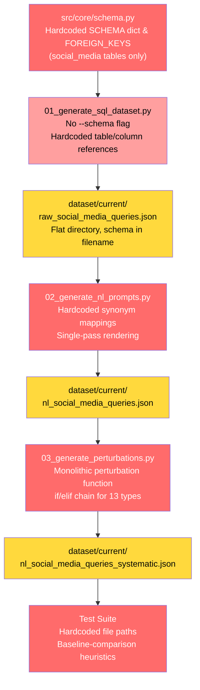
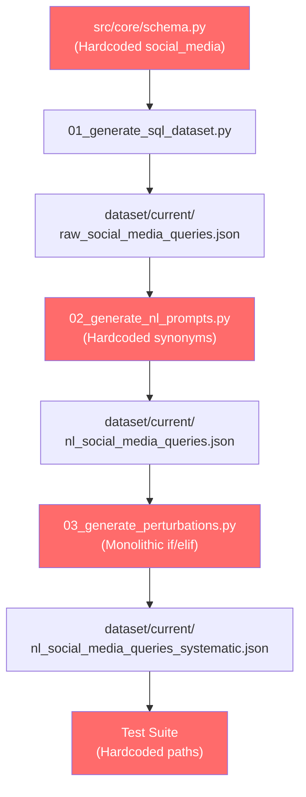
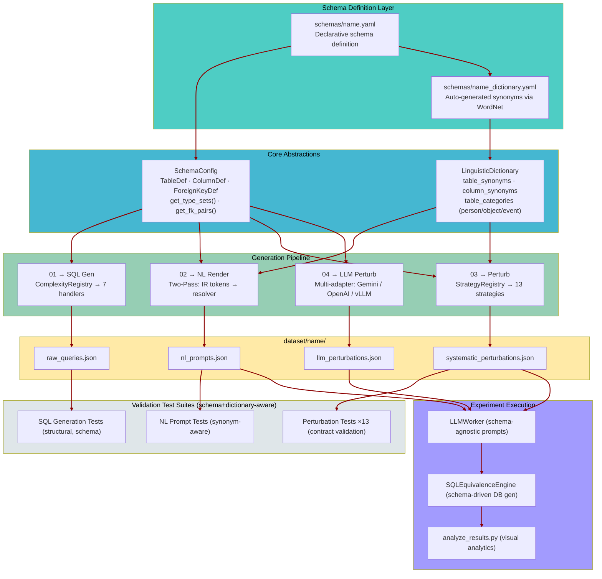
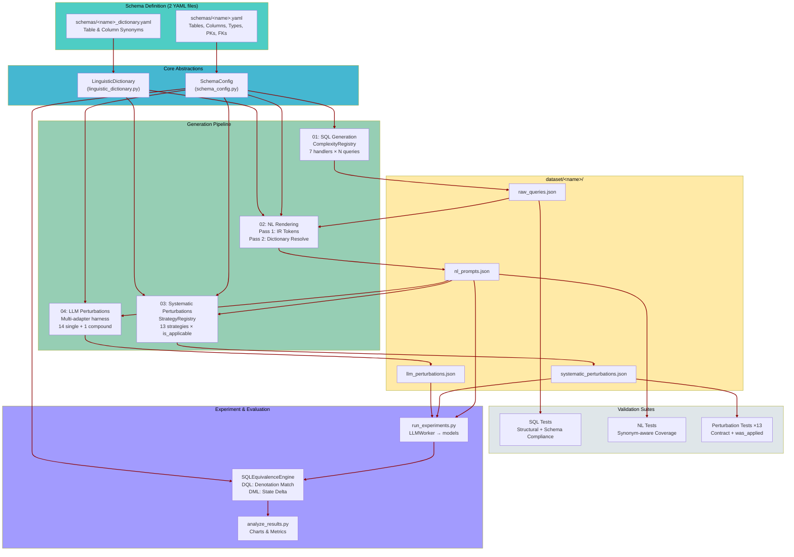
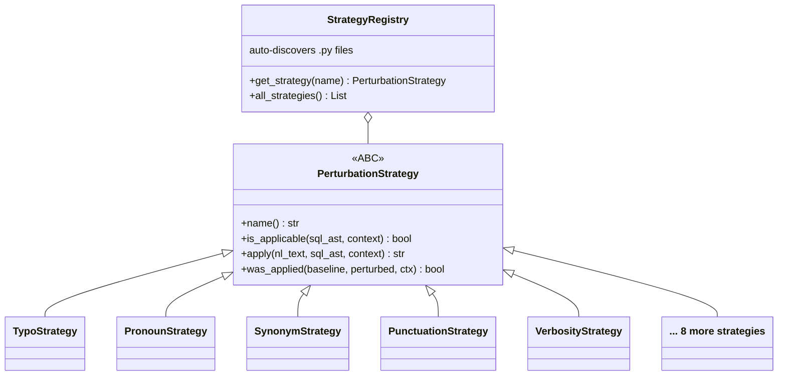
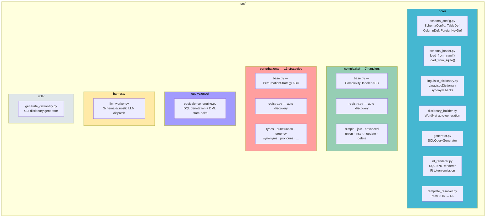
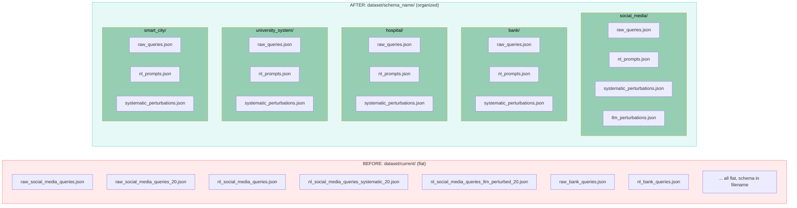
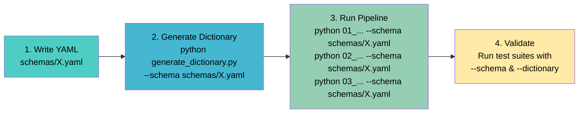
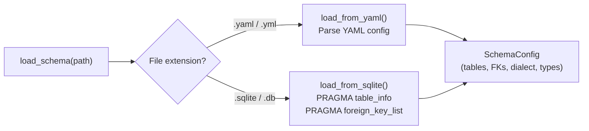

# SQL → NL Pipeline: Progress Report
### Schema-Agnostic Overhaul — Final Status Presentation
**Date:** February 26, 2026

---

## Slide 1: Executive Summary

The SQL → NL → Perturbation → Evaluation pipeline has been transformed from a **single-schema, hardcoded prototype** into a **fully schema-agnostic, extensible framework**.

| Metric | Before | After |
|--------|--------|-------|
| Supported schemas | 1 (social_media only) | **Any** — 6 validated (social_media, bank, hospital, university_system, smart_city, authors) |
| Schema onboarding | Manual code changes in 20+ files | **1 file** (YAML schema or `.sqlite` DB + auto-generated dictionary) |
| Schema input formats | Hardcoded Python dict | **YAML** or **SQLite database** (auto-detected) |
| Perturbation strategies | Monolithic function with if/elif | **13 modular strategies** with auto-discovery registry |
| NL rendering | Single-pass with hardcoded synonyms | **Two-pass IR token architecture** with dictionary-driven resolution |
| Test coverage | Fragile, baseline-comparison heuristics | **Schema+dictionary-aware validation**, 0 failures across 6 schemas |
| Dataset organization | Flat files in `dataset/current/` | **`dataset/<schema>/`** structured directories |

---

## Slide 2: Previous Pipeline Architecture (Before)

The original pipeline was tightly coupled to the `social_media` schema at every layer.



### Key Pain Points

1. **Schema Lock-in:** Adding a new schema (e.g., bank) required editing 20+ source files — schema definitions, renderer synonym maps, generator logic, test paths, and evaluation scripts.
2. **Monolithic Code:** SQL generation used a single 800+ line generator with if/elif chains; perturbations were a single function dispatching 13 types.
3. **Brittle Tests:** Tests compared perturbed text against baseline text using string heuristics, causing false failures when synonyms or rendering varied across schemas.
4. **Flat Dataset Layout:** All files dumped into `dataset/current/` with schema name embedded in filename — unscalable and confusing.

---

## Slide 3: Previous Pipeline Data Flow (Before)



---

## Slide 4: Transformation — 9 Phases of Work

The overhaul was executed in 9 phases, each building on the previous:

| Phase | Name | What Changed |
|-------|------|-------------|
| **1** | Schema Abstraction Layer | `SchemaConfig` dataclass + YAML/SQLite loaders replace hardcoded dicts |
| **2** | Linguistic Dictionary Builder | WordNet-based synonym generation, per-schema YAML dictionaries </br> **(May need LLM here once)** |
| **3** | Complexity Type Registry | 7 handler classes (simple, join, advanced, union, insert, update, delete) with auto-registry |
| **4** | Two-Pass NL Renderer | IR token emission (Pass 1) → Dictionary-driven resolution (Pass 2) |
| **5** | Modular Perturbation Framework | 13 strategy classes with `PerturbationStrategy` ABC + auto-discovery registry |
| **6** | Pipeline Script Refactoring | `--schema` CLI flags, `dataset/<name>/` directories, metadata JSON envelope |
| **7** | Equivalence Checker Generalization | Schema-agnostic DB generation, dynamic system prompts |
| **8** | Test Suite Migration | Schema+dictionary-aware validators, unified test runner |
| **9** | End-to-End Validation | Full pipeline runs on 6 schemas with 0 failures |

---

## Slide 5: Current Architecture Overview (After)



---

## Slide 6: Current Data Flow (After — Detailed)



---

## Slide 7: Key Architectural Innovations

### 7a. Schema Abstraction — From Hardcoded to Declarative

**Before:** A single Python file (`src/core/schema.py`) with hardcoded dictionaries for one schema.

**After:** Any schema is defined in a simple YAML file:

```yaml
# schemas/smart_city.yaml
name: smart_city
dialect: sqlite
tables:
  sensors:
    columns:
      id: { type: int, is_pk: true }
      asset_id: int
      sensor_type: varchar
      is_active: boolean
  # ... more tables
foreign_keys:
  - [assets, sensors, id, asset_id]
```

Loaded at runtime into a `SchemaConfig` object that provides type classification, FK resolution, and legacy-format compatibility.

### 7b. Two-Pass NL Rendering

**Before:** Single-pass renderer with hardcoded synonym maps mixed into rendering logic.

**After:**
- **Pass 1 (IR Emission):** Renderer emits structured tokens: `[TABLE:users]`, `[COL:email]`, `[OP:=]`, `[VERB:find]`
- **Pass 2 (Resolution):** `TemplateResolver` replaces tokens with natural language using the schema's `LinguisticDictionary`, with seeded RNG for reproducibility.

### 7c. Perturbation Strategy Pattern

**Before:** One monolithic function with 13 if/elif branches.

**After:** 13 independent strategy classes, each implementing:



Auto-discovered by `StrategyRegistry` — drop a new `.py` file and it's registered.

### 7d. `is_applicable` / `was_applied` Separation

Critical semantic fix: separated **"can this perturbation apply?"** (pre-generation) from **"did it actually change anything?"** (post-generation). This eliminated false positives in test validation and ensures accurate metadata in output datasets.

---

## Slide 8: Source Code Organization



---

## Slide 9: Dataset Directory Structure



---

## Slide 10: Adding a New Schema — 4 Steps, Zero Code Changes



**Demonstrated live** with `smart_city` (8 tables, 53 columns, 7 FKs) — zero code changes, 51,178 checks, 0 failures.
Also demonstrated with **Spider benchmark** `authors.sqlite` — zero YAML writing, direct SQLite ingest, 50,997 checks, 0 failures.

---

## Slide 11: Validation Results — All 6 Schemas

### Per-Schema Test Results (Latest Run)

| Schema | Source | Tables | FKs | SQL Checks | NL Checks | Perturbation Checks | **Total** | **Failures** |
|--------|--------|--------|-----|-----------|-----------|---------------------|-----------|-------------|
| social_media | YAML | 5 | 6 | 5,958 | 5,170 | 41,260 | 52,388 | **0** |
| bank | YAML | 6 | 5 | 3,847 | 3,262 | 24,177 | 31,286 | **0** |
| hospital | YAML | 7 | 6 | 3,799 | 3,230 | 24,083 | 31,112 | **0** |
| university_system | YAML | 9 | 12 | 6,227 | 5,335 | 39,517 | 51,079 | **0** |
| smart_city | YAML | 8 | 7 | 6,134 | 5,283 | 39,761 | 51,178 | **0** |
| authors | **SQLite** | 5 | 4 | 6,021 | 5,249 | 39,727 | 50,997 | **0** |

> **Grand Total: 268,040+ checks, 0 failures**

### Test Failure Reduction Over Time

| Stage | Failures | Notes |
|-------|----------|-------|
| Initial state (3 schemas) | 6,858 | Fragile baseline-comparison heuristics |
| After perturbation quality fixes | 194 | 97.2% reduction; remaining = synonym rendering variance |
| After schema+dictionary-aware rewrite | 0 | Tests validate against linguistic dictionary, not baseline text |
| After `is_applicable` semantic fix | 0 | Clean separation of pre-generation gate vs. post-generation check |
| After SQLite/Spider validation | 0 | PascalCase case-sensitivity fixes; widened length bounds |
| Current (6 schemas, YAML + SQLite) | **0** | Scales to any schema without regression |

---

## Slide 12: Perturbation Strategy Coverage

All 13 perturbation strategies are validated per-schema. Each strategy implements the full contract:

| Strategy | Description | Checks (smart_city) |
|----------|-------------|---------------------|
| anchored_pronoun_references | Replaces repeated entities with pronouns | 1,050 |
| comment_annotations | Adds parenthetical context annotations | 3,988 |
| incomplete_join_spec | Removes explicit ON clauses from JOINs | 1,742 |
| mixed_sql_nl | Embeds raw SQL keywords within NL text | 3,316 |
| omit_obvious_operation_markers | Drops redundant operation verbs | 4,842 |
| operator_aggregate_variation | Varies phrasing of operators/aggregates | 2,558 |
| phrasal_and_idiomatic_action_substitution | Replaces verbs with idiomatic phrases | 3,364 |
| punctuation_variation | Varies punctuation styles and markers | 3,638 |
| table_column_synonyms | Swaps table/column names for synonyms | 2,067 |
| temporal_expression_variation | Converts dates to relative expressions | 1,728 |
| typos | Introduces realistic character-level typos | 3,858 |
| urgency_qualifiers | Adds urgency/priority markers | 3,288 |
| verbosity_variation | Varies description length/detail level | 4,322 |
| **Total** | | **39,761** |

---

## Slide 13: Validated Schema Profiles

| Schema | Source | Domain | Tables | Columns | Foreign Keys | Column Types |
|--------|--------|--------|--------|---------|--------------|-------------|
| social_media | YAML | Social networking | 5 | 27 | 6 | int, varchar, text, datetime, boolean |
| bank | YAML | Financial services | 6 | 30 | 5 | int, varchar, real, datetime, boolean |
| hospital | YAML | Healthcare | 7 | 38 | 6 | int, varchar, text, datetime, boolean, real |
| university_system | YAML | Education | 9 | 55 | 12 | int, varchar, text, datetime, boolean, real |
| smart_city | YAML | IoT / Infrastructure | 8 | 53 | 7 | int, varchar, text, datetime, boolean, real |
| **authors** | **SQLite** | **Academic publishing** | **5** | **13** | **4** | **INTEGER, TEXT** |

Diverse domains, table counts (5–9), FK topologies, column type mixes, and **naming conventions** (snake_case and PascalCase) — all handled identically.

---

## Slide 14: SQLite Direct-Ingest — Spider Benchmark Validation

The pipeline now accepts **`.sqlite` database files** directly — no manual YAML schema writing required. Schema structure (tables, columns, types, foreign keys) is extracted automatically via SQLite `PRAGMA` introspection.

### Test: `authors.sqlite` from the Spider benchmark

**Source:** `dataset/train/train_databases/authors/authors.sqlite` — a real database from the [Spider](https://yale-lily.github.io/spider) text-to-SQL benchmark.

**Schema (auto-extracted):**

| Table | Columns | Notes |
|-------|---------|-------|
| Author | Id (PK), Name, Affiliation | PascalCase naming |
| Conference | Id (PK), ShortName, FullName, HomePage | |
| Journal | Id (PK), ShortName, FullName, HomePage | |
| Paper | Id (PK), Title, Year, ConferenceId (FK), JournalId (FK), Keyword | 2 foreign keys |
| PaperAuthor | PaperId (FK), AuthorId (FK), Name, Affiliation | Junction table, no explicit PK |

**Pipeline run (zero configuration):**

```
python generate_dictionary.py    --schema authors.sqlite   → schemas/authors_dictionary.yaml
python 01_generate_sql_dataset.py --schema authors.sqlite   → dataset/authors/raw_queries.json
python 02_generate_nl_prompts.py  --schema authors.sqlite   → dataset/authors/nl_prompts.json
python 03_generate_systematic_perturbations.py --schema authors.sqlite → dataset/authors/systematic_perturbations.json
```

**Test results — 0 failures:**

| Test Suite | Total Checks | Passed | Failed |
|------------|-------------|--------|--------|
| SQL generation | 6,021 | 6,021 | **0** |
| NL prompts | 5,249 | 5,249 | **0** |
| Systematic perturbations (13 strategies) | 39,727 | 39,727 | **0** |
| **Total** | **50,997** | **50,997** | **0** |

### How `load_schema()` auto-detection works



### Issues uncovered & fixed

The PascalCase naming convention in Spider databases exposed **case-sensitivity bugs** that were invisible with snake_case-only YAML schemas:

| Bug | Impact | Fix |
|-----|--------|-----|
| `_table_in_nl()` didn't lowercase synonym candidates | Table "Author" not matched in lowered NL text | `.lower()` all candidates before regex matching |
| `col_in_text()` didn't lowercase column names | PascalCase columns like "FullName" missed in lowered text | `.lower()` column names |
| Dictionary synonym `in` checks case-sensitive | 7 perturbation tests failed on PascalCase synonyms | `.lower()` all synonym values before substring check |
| WordNet split "PaperAuthor" → overlapping synonyms | "report", "writer" matched both Paper and PaperAuthor tables | Curated unique synonyms for junction table |

---

## Slide 15: Bugs Discovered & Fixed During Validation

The schema-agnostic overhaul surfaced latent bugs that were invisible with only social_media:

| Bug | Impact | Fix |
|-----|--------|-----|
| `real`/`float` columns got string `'val'` placeholder | Invalid INSERT values for numeric columns | Pass `type_sets` from schema config to generator |
| Composite PK detection hardcoded to social_media | UPDATEs on junction tables in other schemas set PK columns | Infer composite PKs from schema structure |
| DELETE without WHERE clause | Dangerous DML with no filter | Retry loop + `id > 0` fallback |
| NL table matching missed singular/underscore forms | "research_project" not matched for "research_projects" table | Auto-expand match candidates |
| PascalCase names not matched in lowered NL text | Table/column synonym checks failed on Spider databases | `.lower()` all candidates in `_table_in_nl`, `col_in_text`, 5 test files |
| Perturbation re-rendering diverged from baseline | 5 strategies re-rendered from AST instead of modifying NL text | Rewrite to operate on `nl_text` directly |
| `is_applicable` conflated gate + validation | False "applied" flags for non-applicable perturbations | Separate `is_applicable()` (pre) and `was_applied()` (post) |

---

## Slide 16: Technology Stack

| Component | Technology |
|-----------|-----------|
| Language | Python 3.10+ |
| SQL Parsing | sqlglot (AST manipulation) |
| Synonym Generation | NLTK WordNet |
| Schema Format | YAML (PyYAML) **or SQLite database** (auto-detected) |
| SQL Execution | SQLite (in-memory test DBs) |
| LLM Adapters | Gemini, OpenAI, Anthropic, vLLM |
| Testing | Custom contract-based validation framework |
| Experiment Config | YAML (experiments.yaml) |
| Benchmark Compatibility | Spider dataset (`.sqlite` direct ingest) |

---

## Slide 17: Summary & Next Steps

### What We Achieved
- **Complete schema independence** — the pipeline is driven entirely by a YAML schema file **or a `.sqlite` database**
- **Zero-code onboarding** of new database schemas (demonstrated with 6 diverse schemas)
- **Direct SQLite ingest** — successfully tested on the **Spider benchmark** (`authors.sqlite`), proving compatibility with real-world text-to-SQL datasets
- **268,040+ validation checks with 0 failures** across all schemas (YAML and SQLite)
- **Modular, extensible architecture** — new complexity types, perturbation strategies, and LLM adapters via plug-in pattern
- **Clean separation of concerns** — schema definition, linguistic resources, generation logic, and validation are fully decoupled
- **PascalCase and snake_case** naming conventions both fully supported

### Potential Next Steps
[X] Run the pipeline on all the databases for systematic sql, nl_prompts and perturbations generation
- (next) Standardize the evaluation harness used for query equivalence testing
- Run full experiment execution across multiple LLMs on all 6 schemas
- Explore finetuning a small model on NL-SQL task and see results pre and post tuning.
- Try to Benchmark NL→SQL model accuracy degradation across perturbation types
- Explore cross-schema transfer learning in NL→SQL models (methods other than finetuning; Sina's idea is one thing to explore)
- 
